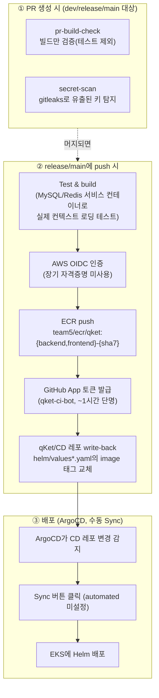

# Qket CI/CD 파이프라인

`backend`/`frontend`/`Infra`/`CD` 4개 레포가 어떻게 연결돼서 코드 push부터 실제 배포까지 이어지는지 정리한 문서.

---

## 전체 흐름

## 단계별 설명

### ① PR 검증 — `pr-build-check.yml` / `secret-scan.yml`

`dev`/`release`/`main`으로 향하는 모든 PR에서 실행된다.

- **pr-build-check**: `./gradlew clean build -x test`(backend), `npm run build`(frontend)로 빌드만 확인 — 테스트는 여기서 안 돈다(테스트는 ②의 release/main push 시점에만 돈다).
- **secret-scan**: gitleaks CLI를 직접 받아서 실행(공식 Action 래퍼는 org private 레포에 라이선스를 요구해서 제거하고 CLI 직접 실행으로 대체). API 키/시크릿이 커밋에 섞여 들어가는 걸 병합 전에 차단.

### ② 이미지 빌드 & ECR push & write-back — `CI-release.yml` / `CI-main.yml`

`release`(→ release 환경) / `main`(→ prod 환경) 브랜치에 push될 때만 실행된다. backend/frontend 구조는 동일, 트리거 브랜치와 write-back 대상 파일만 다르다.

1. **Test & build**: 이번엔 테스트를 실제로 돌린다. CI 러너에 MySQL/Redis 서비스 컨테이너를 띄워서 컨텍스트 로딩 테스트가 실제로 DB/Redis에 붙어보게 함 — 예전엔 이 컨테이너가 없어서 테스트가 사실상 아무것도 검증 못 하고 있었음.
2. **AWS 인증**: 고정 Access Key 대신 **OIDC**로 임시 자격증명 발급 — GitHub Secrets에 장기 AWS 키를 두지 않는다는 원칙.
3. **ECR push**: 이미지 태그는 `{backend,frontend}-{커밋SHA 앞 7자리}` 형식.
4. **GitHub App 토큰 발급**: `qket-ci-bot`(qKet 조직 소유, `CD` 레포에만 설치, Contents Read/Write 권한만)으로 실행마다 새로 단명 토큰을 받는다 — 개인 PAT처럼 장기 자격증명을 시크릿에 두지 않기 위함.
5. **CD 레포 write-back**: `qKet/CD`를 체크아웃해서 `helm/values*.yaml`의 `backend:`/`frontend:` 블록 안 `image:` 값만 `sed`로 치환 후 commit/push.

### ③ 배포 — ArgoCD

CD 레포의 변경을 ArgoCD가 감지하면, **자동이 아니라 수동으로 Sync 버튼을 눌러야** 실제 배포가 일어난다 — `automated`(prune/selfHeal)를 의도적으로 켜지 않음(운영 중 실수로 원치 않는 배포가 자동으로 나가는 것을 방지). `namespace`/`ingress`/`networkpolicy`는 별도로 `Infra/kubernetes`를 보는 ArgoCD Application(`infra-manifests`)이 담당하고, `Deployment`/`Service`는 `CD` 레포를 보는 Application이 담당 — 두 책임이 레포 단위로 나뉘어 있다.

---

## 설계 원칙

- **장기 자격증명을 어디에도 평문으로 두지 않는다** — AWS는 OIDC, CD 레포 write-back은 GitHub App. CI 도구로 GitHub Actions를 고른 이유를 포함해 자세한 배경은 wiki `decisions/2026-08-06-ci-tool-github-actions.md`, `decisions/2026-08-10-cd-writeback-github-app.md` 참고.
- **"빌드 성공"과 "테스트 통과"를 구분**: PR 단계는 빌드만, release/main push 단계에서만 실제 테스트가 돈다.
- **배포 자동화와 배포 안전성을 분리**: 이미지 push까지는 완전 자동, 실제 클러스터 반영(Sync)은 사람이 마지막에 확인하고 누른다.

## 현재 알려진 이슈

> ⚠️ **backend/frontend `CI-release.yml`이 write-back하는 `helm/values-release.yaml`이 `CD` 레포(`dev`/`main` 브랜치 모두)에 존재하지 않는다.** CD 레포는 아직 `helm/values.yaml`(release용) + `helm/values-prod.yaml` 구조를 쓰고 있어서, 2026-08-21에 결정된 `values.yaml → values-release.yaml` 리네임이 `backend`/`frontend`의 워크플로 코드에만 반영되고 `CD` 레포 쪽엔 아직 반영되지 않은 상태(2026-08-24 기준)로 보인다. 이 상태에서 `release` 브랜치에 push하면 write-back 스텝에서 `sed -i`가 대상 파일을 못 찾아 실패할 가능성이 높다 — 실제 배포 전 CD 레포의 파일명을 맞추거나 워크플로의 대상 파일명을 되돌리는 조치가 필요하다.

## 참고

- `wiki/decisions/2026-08-06-ci-tool-github-actions.md`
- `wiki/decisions/2026-08-10-cd-writeback-github-app.md`
- `wiki/decisions/2026-08-21-release-datastore-rds-to-statefulset.md` — `values-release.yaml` 리네임이 언급된 결정
- `backend/README.md`, `frontend/README.md`, `Infra/README.md`
