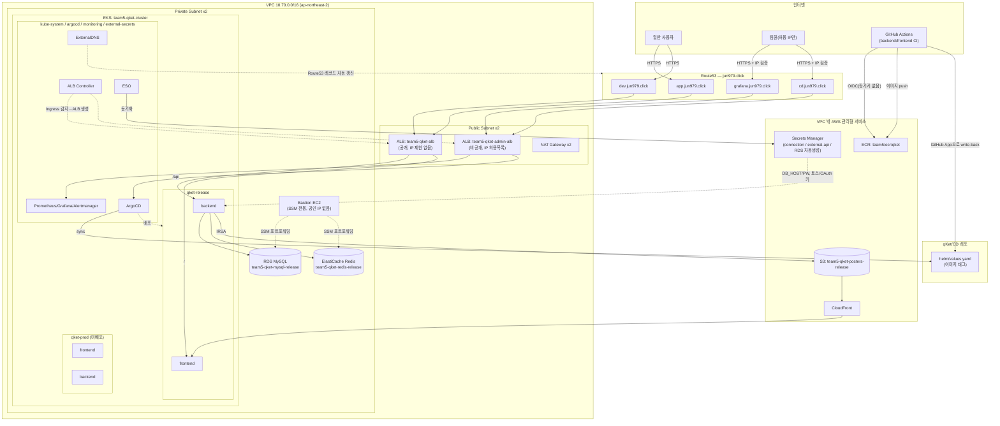
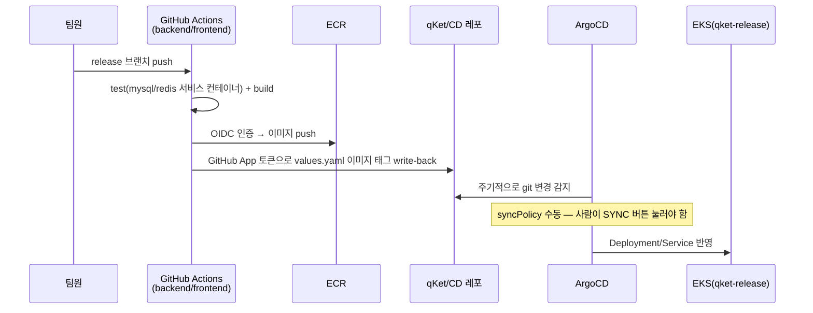

# Qket 인프라 아키텍처 (2026-08-12 기준)

이 문서는 현재 실제로 떠있는(라이브) 인프라 구조를 정리한 것이다. Terraform root 구조(`01_infrastructure`/`02_k8s-addon`/`03_registry`/`04_data`)와 실제 AWS/K8s 배치가 어떻게 대응되는지 한눈에 보기 위한 용도 — 코드 자체의 이유/트레이드오프는 `CLAUDE_LLM_WIKI`(architecture/decisions/troubleshooting)에 더 자세히 있음.

> ⚠️ `04_data`는 지금 `release` workspace만 실제로 적용돼 있고, `prod`는 아직 apply 전이다(코드는 준비됨). 아래 다이어그램은 release 기준.
> ⚠️ `01_infrastructure`/`02_k8s-addon`은 비용 절감을 위해 매일 밤 destroy → 아침 재생성한다(`README.md`의 "매일 아침/저녁" 참고) — 그래서 이 다이어그램은 "낮 시간대 기준"이다.

## 전체 구조

## CI/CD 플로우

## 레이어별 Terraform root 대응

| Root | 실제로 관리하는 것 | 매일 밤 destroy? |
|---|---|---|
| `01_infrastructure` | VPC, 서브넷, IGW, NAT, EKS(클러스터+노드그룹), bastion EC2 | ✅ (EKS/bastion/NAT만, VPC/서브넷은 유지) |
| `02_k8s-addon` | namespace, ArgoCD, ALB Controller, ExternalDNS, ESO 컨트롤러, 모니터링 스택, Ingress(app/admin) | ✅ |
| `03_registry` | ECR, GitHub Actions OIDC role | ❌ (절대 안 지움) |
| `04_data` | RDS, Redis, S3+CloudFront, Secrets Manager(connection/external-api), IRSA | ❌ (AWS 리소스는 유지, K8s 오브젝트만 매일 아침 재생성) |

## 관련 문서
- `CLAUDE_LLM_WIKI/wiki/troubleshooting/eks-destroy-layer-separation.md` — 이렇게 나눈 이유
- `CLAUDE_LLM_WIKI/wiki/decisions/2026-08-11-monitoring-stack-design.md` — 모니터링 설계
- `Infra/README.md` — 매일 아침/저녁 명령어
