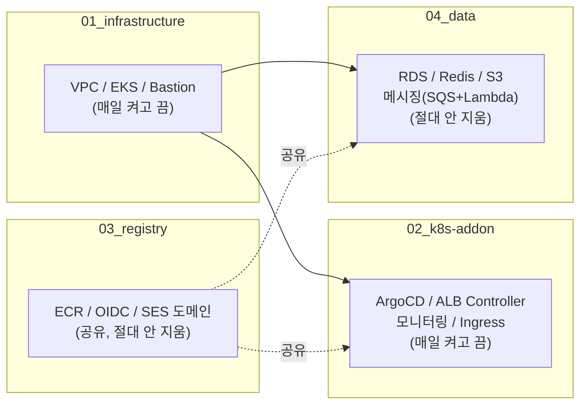
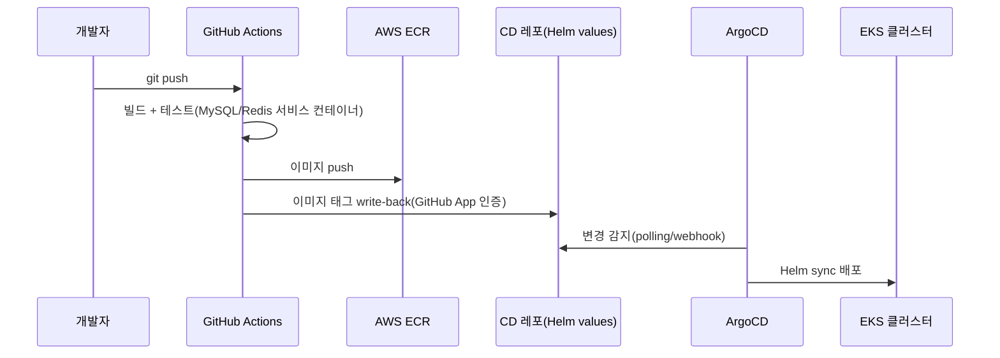

# Q-Ket 프로젝트 기획서

## 1. 프로젝트 개요

| 항목 | 내용 |
|---|---|
| 프로젝트명 | **Q-Ket (Qket)** |
| 한 줄 소개 | 공연 예매 시 발생하는 동시접속 트래픽 폭주를, 대기열 시스템과 프로덕션 수준의 인프라로 안정적으로 처리하는 공연 예매 플랫폼 |
| 팀 구성 | 5인 [강진호, 나윤준, 문준혁, 이채영, 정우진 ] |
| 진행 단계 | 2차 프로젝트(핵심 기능 구현) → 최종 프로젝트(고도화) |
| 기술 스택 | Spring Boot / Next.js / MySQL / Redis / AWS EKS / Terraform |

---

## 2. 기획 배경

### 왜 이 주제를 선택했는가

이 프로젝트를 시작한 동기는 기능 하나를 더 만드는 것이 아니라 **"인프라의 중요성을 직접 몸으로 체감해보고 싶다"**는 것이었습니다. 화면과 API가 정상 동작하는 것만으로는 알 수 없는 것 — 트래픽이 몰렸을 때 시스템이 어떻게 무너지는지, 그걸 어떻게 막는지 — 를 직접 설계하고 겪어보는 것을 목표로 잡았습니다.

이 목표를 구체적인 도메인으로 좁히면서 떠올린 것이 **공연 예매 시스템의 티켓 오픈런**이었습니다. 인기 콘서트/뮤지컬 예매가 열리는 순간 수천~수만 명이 동시에 접속해 짧은 시간에 몰리는 현상은 실제로 자주 발생하는 문제이고, 이걸 그냥 "서버를 크게 키운다"가 아니라 **대기열 서버를 통한 트래픽 관리**로 풀어보는 것을 핵심 과제로 정했습니다.

### 문제 정의

- 예매 오픈 순간 대량의 동시 요청이 백엔드/DB에 그대로 꽂히면 응답 지연·타임아웃·좌석 중복 판매 같은 문제가 발생한다.
- 이걸 막으려면 사용자를 곧바로 예매 로직에 들여보내지 않고, **대기열에서 순번을 관리하며 처리 가능한 속도로만 입장시키는 구조**가 필요하다.
- 이 구조 자체가 이 프로젝트의 핵심 기술적 도전 과제다 (자세한 내용은 6장 참고).

---

## 3. 2차 프로젝트 회고 — 무엇을 만들었고, 무엇이 부족했는가

### 완성한 것

- 대기열 서버(Redis 기반) — 티켓 오픈 시 사용자를 대기열에 순서대로 세우고, 처리 가능한 만큼만 예매 페이지로 입장시키는 구조
- 회원가입/로그인 및 세션 관리, 공연 조회, 좌석 선택/예매, 결제 연동까지 이어지는 기본 예매 플로우
- 관리자 기능(사용자·역할·공연·메뉴 관리)까지 포함한 완결된 서비스 하나를 끝까지 만들어봄

### 부족했던 점 — 왜 "고도화"가 필요했는가

2차 프로젝트를 마치고 나서 팀이 공통적으로 느낀 한계:

- **CI/CD가 불안정하고 부실했다** — 배포 파이프라인이 있긴 했지만 신뢰하고 맡길 수 있는 수준이 아니었고, 배포 과정에서 무엇이 실제로 검증되고 무엇이 안 되는지가 불명확했다.
- **인프라가 "일단 돌아가게만" 구성돼 있었다** — 코드로 관리되지 않는 수동 설정, 장애 상황을 가정하지 않은 구조, 시크릿/키 관리가 임기응변적이었다.
- **트래픽 몰림 대응이 설계 수준에 머물러 있었다** — 대기열 자체는 동작했지만, 그 대기열이 실제로 얼마나 많은 부하를 견디는지, 어떤 지점에서 무너지는지에 대한 실측·모니터링이 없었다.

이 세 가지가 최종 프로젝트의 방향을 결정했습니다.

---

## 4. 최종 프로젝트 목표 — "새로 만들기"가 아니라 "고도화"

최종 프로젝트에서는 기능을 새로 추가하는 대신, **2차 프로젝트에서 만든 산출물을 프로덕션 수준으로 끌어올리는 것**을 목표로 선택했습니다. 이는 처음의 동기("인프라의 중요성을 체감하고 싶다")와도 직결되는 결정입니다 — 실제 현업에서 인프라 작업의 대부분은 새 기능이 아니라 기존 시스템을 더 안전하고, 더 관측 가능하고, 더 자동화된 상태로 끌어올리는 일이기 때문입니다.

구체적인 고도화 축은 4가지:

1. **CI/CD 신뢰성 확보** — "빌드가 성공한다"와 "배포하면 실제로 동작한다"를 구분하고, 후자까지 보장하는 파이프라인으로
2. **인프라의 코드화(IaC)와 안전한 운영** — 수동 설정을 Terraform으로 전면 이관하고, 장애/실수 상황(destroy 순서, 시크릿 유실 등)에도 복구 가능한 구조로
3. **보안/시크릿 관리 자동화** — 외부 API 키·DB 자격증명을 코드에 박아두지 않고 AWS Secrets Manager + 자동 동기화로
4. **관측성(Observability) 확보** — 대기열/서비스 상태를 실시간으로 볼 수 있는 모니터링 스택 구축

자세한 실행 내역은 9장에서 다룹니다.

---

## 5. 서비스 개요 (기능 명세)

### 사용자 기능

- 회원가입 / 로그인 (자체 로그인 + Google·Kakao·Naver 소셜 로그인)
- 공연 목록/상세 조회, 회차별 좌석 조회
- **대기열 진입 및 실시간 순번 확인** (예매 오픈 시 자동 적용)
- 좌석 선택 및 예매
- Toss Payments 연동 결제
- 마이페이지 — 예매 내역 조회
- *(예정)* 예매확정/취소 이메일 알림

### 관리자 기능

- 공연/회차/좌석 등록 및 관리
- 사용자 조회 및 권한(Role) 관리
- 프로그램/메뉴 관리 — 화면에 노출되는 메뉴를 role별로 동적으로 구성(DB 기반, 하드코딩 아님)

### 권한 구조

- Role은 `USER` / `MANAGER` / `ADMIN` 3단계
- 화면에 보이는 메뉴(동적 메뉴 시스템)와 실제 API 접근 권한(백엔드 하드코딩 role 체크)을 **의도적으로 분리** — 메뉴 노출은 UX일 뿐 보안 경계가 아니며, 실제 보안은 API 레벨에서 이중으로 보장하도록 설계했습니다.

---

## 6. 핵심 기술 챌린지 — 트래픽 몰림과 대기열

### 구조

```
사용자 → 대기열 진입(QueueService, Redis 기반)
       → 3초 간격 폴링으로 순번 확인
       → 처리 가능한 인원만 예매 페이지로 입장(admission)
       → 좌석 선택 → 결제
```

### 실측을 통해 확인한 부하 규모

설계만으로 끝내지 않고, 실제 트래픽 패턴을 기준으로 대기열이 만들어내는 부하를 직접 계산·검증했습니다.

- 대기열 상태 조회(폴링) 요청 하나마다 Redis 커맨드가 최소 4~5개 발생(토큰 조회, 입장 락 획득, 만료 정리, 대기 순번 계산, TTL 갱신 등)
- **대기자 5,000명이 3초 간격으로 폴링하는 티켓 오픈 상황을 가정하면, 대기열 하나에서만 초당 약 8,000개의 Redis 명령어**가 발생 — 최소 사양 Redis 노드(`cache.t3.micro`)의 버스트 크레딧으로는 이 정도 지속 부하를 감당하기 빠듯하다는 것을 실측 기반으로 확인
- 이 수치를 근거로, 세션(로그인 유지)과 대기열이 지금 같은 Redis 노드를 공유하는 구조가 "티켓 오픈 순간 대기열이 폭주하면 결제 중인 사용자의 로그인 세션까지 같이 느려질 수 있다"는 리스크(noisy neighbor)로 이어진다는 걸 확인했고, 이를 팀 결정 사항으로 문서화했습니다.

### 대응 방향

- **1차 대응(확정)**: 운영 전환 시점에 Redis 오토 페일오버를 켜서 노드 장애 시 큐+세션이 동시에 마비되는 것부터 방지
- **2차 검토(진행 예정)**: 실제 오픈런 트래픽을 흉내낸 부하테스트로 싱글 노드의 실제 한계치를 측정하고, 그 결과에 따라 세션/대기열 Redis 물리 분리 여부를 결정 — "분리하면 무조건 안전해진다"가 아니라 "분리는 비용 증가이므로 실측 없이 성급하게 결정하지 않는다"는 원칙을 세움

이 과정 자체가 "감으로 인프라를 늘리지 않고, 숫자로 판단한다"는 이번 최종 프로젝트의 태도를 가장 잘 보여주는 사례입니다.

---

## 7. 기술 스택

| 영역 | 기술 |
|---|---|
| Backend | Spring Boot, MyBatis, Redis(Spring Session), Redisson(분산 락) |
| Frontend | Next.js, TypeScript |
| Database | MySQL (AWS RDS) |
| 인증 | 자체 로그인(세션) + Google/Kakao/Naver OAuth |
| 결제 | Toss Payments |
| 인프라 | AWS EKS(Kubernetes), Terraform(IaC), ArgoCD(GitOps) |
| CI/CD | GitHub Actions + OIDC(장기 자격증명 미사용) |
| 시크릿 관리 | AWS Secrets Manager + External Secrets Operator(ESO) |
| 네트워킹 | AWS ALB(Ingress), Route53, ACM |
| 관측성 | Prometheus(kube-prometheus-stack), Grafana, Amazon Managed Prometheus(AMP) |
| 알림 인프라 | Amazon SQS + Lambda + SES *(고도화 중)* |

---

## 8. 시스템 아키텍처 개요

### 인프라 계층 구조 (Terraform 4-root)

인프라 전체를 하나의 Terraform 상태로 관리하지 않고, **책임과 lifecycle이 다른 4개의 독립된 단위(root)**로 나눠서 관리합니다.



- **01_infrastructure / 02_k8s-addon**: 비용 절감을 위해 매일 밤 destroy → 아침에 재생성하는 대상. 순수 AWS 리소스(01)와 K8s addon(02)을 분리해서, destroy 순서가 꼬여도 인증 수단이 먼저 사라지는 사고를 구조적으로 방지합니다.
- **03_registry / 04_data**: 절대 지우지 않는 영구 리소스. 도메인 인증, 컨테이너 레지스트리, 실제 서비스 데이터(RDS/Redis)가 여기 있습니다.

### CI/CD 흐름



- 배포 자격증명을 GitHub Secrets에 장기 보관하지 않고 **AWS OIDC**로 임시 발급받아 사용
- CD 레포 write-back도 개인 PAT 대신 **조직 소유 GitHub App**으로 — 장기 자격증명을 어디에도 평문으로 남기지 않는다는 원칙을 CI/CD 전 구간에 일관 적용

---

## 9. 최종 프로젝트에서 실제로 고도화한 내용

2차 프로젝트에서 지적됐던 세 가지 한계(3장)에 대응해 실제로 진행한 작업입니다.

### 9-1. CI/CD 신뢰성 확보

- **테스트가 실제로 검증되게 함**: 백엔드 CI가 MySQL/Redis 없이 돌아가서 컨텍스트 로딩 테스트가 사실상 무의미했던 문제를 GitHub Actions 서비스 컨테이너로 해결
- **"빌드 성공 ≠ 배포 시 동작"을 실제 코드 리뷰로 검증**: CD Helm 차트를 실제로 배포했을 때 동작하는지 코드 기준으로 전수 점검해서, 프론트-백엔드 연결 주소 누락, ArgoCD 배포 경로 오류, 불필요한 중복 빌드, 필수 환경변수 누락 등 실제로 서비스를 깨뜨렸을 문제 4가지를 배포 전에 발견/수정
- **프론트 빌드 타임 값 처리 방식 교정**: `/api` 요청 라우팅을 Next.js `rewrites()`(빌드 타임에 값이 고정되는 방식이라 컨테이너 재사용 배포와 충돌해 실제 장애를 유발함)에서, 빌드와 무관하게 동작하는 **ALB path 기반 라우팅**으로 전환

### 9-2. 인프라의 코드화(IaC)와 안전한 운영

- Terraform으로 EKS/네트워크/DB/캐시/DNS/인증서까지 전 구간 코드화 (8장 참고)
- **실제 장애 상황을 겪고 구조적으로 재발 방지**: destroy 순서를 어겼을 때 IAM 손상, ALB/보안그룹 고아 리소스, "죽은 컨트롤러의 admission webhook이 클러스터 전체의 리소스 삭제를 영구히 막는" 데드락까지 실전에서 겪고 복구 — 이 경험을 바탕으로 레이어 분리 구조(8장)와 방어적 코드 패턴(`try()` 등)을 코드에 반영해 같은 사고가 재발하지 않도록 구조 자체를 고쳤습니다.

### 9-3. 시크릿 관리 자동화

- OAuth 3사 클라이언트 키, 결제 연동 키 등 외부 API 키를 코드/GitHub Secrets에 흩어두지 않고, **AWS Secrets Manager 단일 저장소 + External Secrets Operator(ESO)**로 K8s Secret에 자동 동기화
- 프론트 빌드 시점에만 필요한 키도 GitHub Secrets를 늘리지 않고 CI가 이미 가진 AWS 인증(OIDC)으로 직접 조회하도록 해서, **시크릿의 출처를 하나로 유지**

### 9-4. 관측성(Observability) 확보

- kube-prometheus-stack + Grafana로 클러스터/서비스 지표 시각화
- 지표 영구 저장을 EBS가 아니라 **Amazon Managed Prometheus(AMP)**로 설계 — EBS는 클러스터를 재생성하면 볼륨도 함께 사라져 "클러스터가 매일 재생성돼도 지표 이력은 유지된다"는 목표를 못 채운다는 걸 확인하고, 완전히 분리된 관리형 서비스로 전환
- 관리 도구(Grafana/ArgoCD)는 IP 허용목록으로 접근을 제한해 노출 범위를 최소화

### 9-5. 확장 — 비동기 알림 인프라

- 예매확정/취소 알림을 위한 **SQS → Lambda → SES** 비동기 파이프라인 설계 및 구축
- 단일 소비자 구조라는 점을 근거로 SNS(fan-out) 대신 SQS(단일 큐, 재시도/DLQ)를 선택하는 등, 필요 이상으로 복잡한 구조를 만들지 않는 것을 원칙으로 설계

---

## 10. 기대 효과 / 배운 점

- **"돌아간다"와 "안전하게 운영 가능하다"는 다르다는 것을 실전으로 확인** — 기능 구현만으로는 드러나지 않던 문제(CI/CD 신뢰성, destroy 순서, 시크릿 유실, 웹훅 데드락 등)를 실제로 겪고 고쳐본 경험
- **감이 아니라 실측으로 인프라를 판단하는 습관** — 대기열 부하를 추정이 아니라 실제 트래픽 패턴 기반 계산으로 검증하고, 그 결과에 따라 다음 단계(물리 분리 여부)를 결정하는 방식을 팀 전체가 체득
- 이 모든 과정이 애초 동기였던 **"인프라의 중요성을 몸소 체감하고 싶다"**는 목표에 정확히 부합하는 경험이 됨

---

## 11. (남은 과제)

- 대기열 실측 부하테스트 및 세션/대기열 Redis 물리 분리 여부 최종 결정
- 로그 수집(Loki 등) 및 모니터링 알림 채널(Slack/이메일) 구축
- dev/관리 도구 접근제어를 VPN 기반으로 전환할지 여부(팀 논의 중, 보류)
- 예매확정/취소 알림 기능을 실제 백엔드 로직에 연결(현재는 인프라만 구축된 상태)
- SES 발신 도메인 SPF 레코드 등록
- prod 환경 실제 적용 및 운영 전환(Redis 페일오버 포함)

---

## 12. 팀 구성 및 역할

| 이름 | 역할 | 담당 영역 |
|---|---|---|
| [이채영] | [팀장] | [총괄,테라폼] |
| [강진호] | [조원] | [애플리케이션(프론트앤드,백엔드),ArgoCD,k8s메니페스트] |
| [나윤준] | [조원] | [애플리케이션(프론트앤드,백엔드),Monitoring,부하테스트] |
| [문준혁] | [조원] | [애플리케이션(프론트앤드,백엔드),MailServer] |
| [정우진] | [조원] | [애플리케이션(프론트앤드,백엔드),MailServer] |
